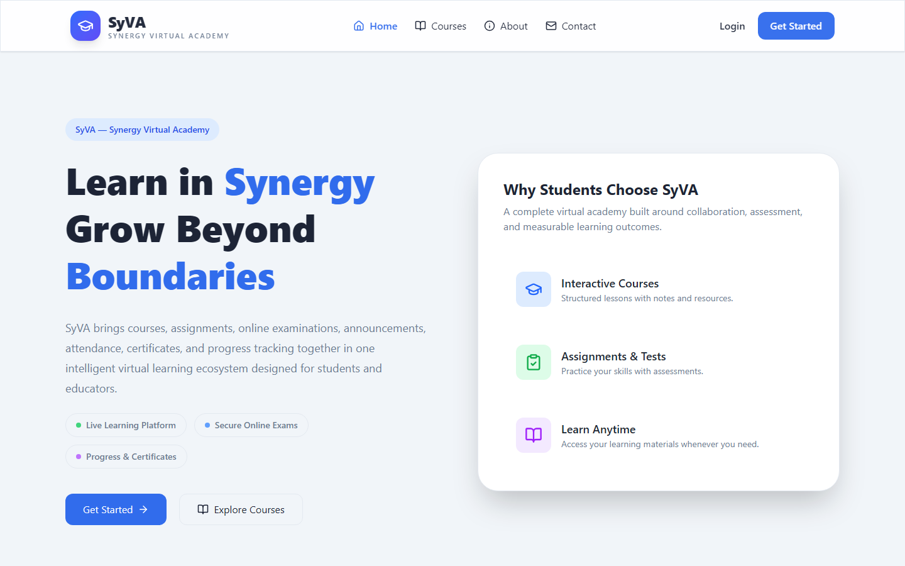

# 📚 CPDD LMS — Learning Management System Frontend

A React/TypeScript learning-management frontend built during an internship at **CPDD**. The demo shows student, instructor, and admin flows for course management, assessments, and progress tracking. It uses seeded data and browser `localStorage`; it is not connected to a production backend.

🔗 **Live Demo:** [https://lms-omega-gray.vercel.app](https://lms-omega-gray.vercel.app)
📁 **GitHub:** [https://github.com/Mo7taseb/LMS](https://github.com/Mo7taseb/LMS)



---

## 🎯 Features

### 👨‍🎓 Student
- Browse and search courses by category, level, and price
- Try a simulated course-enrollment and payment flow (no real payment is processed)
- Watch video lessons and track progress per lesson
- Take quizzes and assessments with instant feedback
- View enrolled courses and completion status on the **My Learning** page

### 👨‍💼 Admin
- Full **Admin Dashboard** with system overview
- **Course Management** — create, edit, and delete courses
- **User Management** — manage all users and roles
- **Assessment Management** — create and manage quizzes/assessments

### 🔐 Auth & Access Control
- Demo register/login backed by browser `localStorage` (not production authentication)
- Client-side role-based routes (`student` / `instructor` / `admin`)
- Persistent demo auth state via `AuthContext`

---

## 🛠️ Tech Stack

| Technology | Purpose |
|---|---|
| **React 18** | UI framework |
| **TypeScript** | Type safety |
| **Vite** | Build tool & dev server |
| **Tailwind CSS** | Utility-first styling |
| **shadcn/ui** | Accessible UI components |
| **React Router v6** | Client-side routing |
| **Axios** | HTTP requests |
| **TanStack Query** | Server state management |
| **localStorage** | Persistent mock data store |

---

## 🗂️ Project Structure

```
src/
├── components/
│   ├── layout/          # Sidebar, Navbar, Layout wrapper
│   └── ui/              # shadcn/ui components
├── contexts/
│   └── AuthContext.tsx  # Global auth state
├── data/
│   ├── mockData.ts      # Seeded courses, users, progress
│   └── types.ts         # TypeScript interfaces
├── pages/
│   ├── admin/           # Admin dashboard, course & assessment mgmt
│   ├── Courses.tsx
│   ├── CourseDetails.tsx
│   ├── CourseContent.tsx
│   ├── MyLearning.tsx
│   ├── Enroll.tsx
│   ├── Assessment.tsx
│   ├── Profile.tsx
│   ├── Settings.tsx
│   ├── Login.tsx
│   └── Register.tsx
├── services/
│   ├── courseApi.ts          # Course service layer
│   └── localStorageService.ts # Mock DB with CRUD operations
└── App.tsx                   # Routes & providers
```

---

## 🚀 Getting Started Locally

```sh
# 1. Clone the repo
git clone https://github.com/Mo7taseb/LMS.git
cd LMS

# 2. Install dependencies
npm install

# 3. Start the dev server
npm run dev
```

Open [http://localhost:5173](http://localhost:5173) in your browser.

### 🧪 Demo Credentials

| Role | Email | Password |
|---|---|---|
| Admin | m@example.com | password |
| Student | jane.smith@example.com | password |
| Instructor | sarah.johnson@example.com | password |

> The app uses a mock auth system — only the email is validated. Any password of 6+ characters works.

---

## 📦 Build & Deploy

```sh
npm run build
```

The `dist/` folder can be deployed to **Vercel**, **Netlify**, or any static hosting service.

---

## 🧠 Key Implementation Highlights

- **Role-based routing** — `ProtectedRoute` and `RoleRoute` components guard pages by authentication status and user role
- **Service layer abstraction** — `courseApi.ts` and `localStorageService.ts` separate data logic from UI components, making it easy to swap in a real backend
- **Mock database** — `localStorage` is seeded with realistic data (courses, instructors, users, progress) on first load, simulating a real API
- **Optimistic UI** — enrollment, progress updates, and quiz submissions feel instant with local state updates
